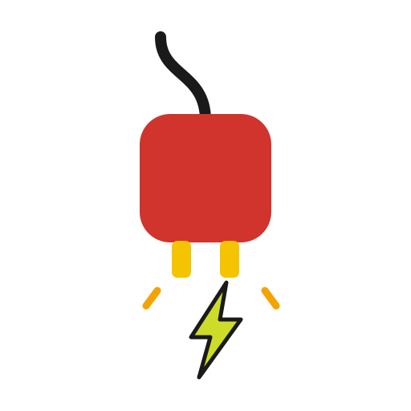

# SparkPlug ⚡




**発表者と参加者の間に流れる情報を可視化・拡張・保存する** — コミュニティイベント向けのリアルタイム盛り上げ + 振り返りアプリ。

> Spark plug = 点火プラグ。エンジンをかける。場に火をつける。

## 3つの機能軸

| 軸 | 機能 |
|---|---|
| 🔥 盛り上げ | コメント流し・リアクション爆発・SE/音・演出 |
| 🎤 拾い上げ | アンケート・投票・自由記述・クイズ |
| 📊 振り返り | ログ分析・AIまとめ・タイムライン・繋がり可視化 |

## アーキテクチャ

```
参加者 / 発表者 / ホスト / 会場スクリーン (ブラウザ SPA)
        │ HTTPS / WebSocket
        ▼
┌─ Azure Static Web Apps Free ─── apps/web (React + Vite)
└─ Azure Container Apps ───────── apps/server (Express + Socket.IO)
        │
        ├─ Cosmos DB Free Tier (イベントログ / アンケート結果)
        └─ AI 分析: GitHub Models (試作) → Azure OpenAI (本番)
CI/CD: GitHub Actions
```

コスト方針: 開発中はほぼ ¥0（SWA Free + Container Apps scale-to-zero + Cosmos Free Tier）。イベント当日のみ min replica 1 に上げて数十〜数百円/日。

## リポジトリ構成

```
apps/
  web/       React + Vite SPA（host / presenter / audience / screen の4ビュー）
  server/    Express + Socket.IO リアルタイムサーバー
packages/
  shared/    クライアント/サーバー共有の Socket.IO イベント型定義
```

## 開発

```bash
npm install
npm run build          # shared → server → web の順にビルド
npm run dev:server     # http://localhost:3001 (ヘルスチェック: /health)
npm run dev:web        # http://localhost:5173
```

※ 初回は `npm run build` で `packages/shared` をビルドしてから dev を起動すること。

## Roadmap

- [x] モノレポ雛形（web / server / shared）
- [x] リアクション送受信のリアルタイムデモ（ルーム = イベント単位）
- [x] コメント流し（参加者 → 会場スクリーン、匿名/記名）
- [x] SE 再生（ドン/カッ/拍手はフリー素材 mp3、ドラムロール/ファンファーレは Web Audio API 合成）
- [x] 選択式アンケート + リアルタイム集計（ホスト作成/締切、投票し直し可、スクリーンにライブ表示）
- [ ] Dockerfile + Azure Container Apps デプロイ（Bicep）
- [ ] Azure Static Web Apps デプロイ + GitHub Actions CD
- [x] ログ CSV エクスポート（UTF-8 BOM、Excel対応。※現状 in-memory、サーバー再起動で消える）
- [ ] イベントログ永続化（Cosmos DB）
- [x] 発表者ビュー: エモメーター（波形＋熱量＋バイブ）・質問（参加者が表示名付きで発表者に送る）
- [ ] 質問トリアージ（質問投稿・いいね・今答える/後で/後日の振り分け）
- [ ] AI 振り返り分析

## ブランドアセット

| ファイル | 用途 |
|---|---|
| `assets/logo.svg` | メインロゴ（点火するプラグ） |
| `assets/icon.svg` + `icon-192/512.png` | PWA・ファビコン用アイコン |
| `assets/wordmark.svg` | サイトヘッダー・ドキュメント用ワードマーク |
| `assets/plug-community-logo.png` | PLUG コミュニティ本体のロゴ |

SparkPlug は [PLUG（Power Platform Local User Group）](https://github.com/PLUG365) 発のプロジェクトです。

## クレジット

効果音素材: [OtoLogic](https://otologic.jp/)（CC BY 4.0）
`apps/web/public/se/` の mp3 は OtoLogic 素材（Percussive_Accent04 / Hyoshigi01 / Applause02）をリネームして使用。

## License

MIT（効果音 mp3 を除く。上記クレジット参照）
