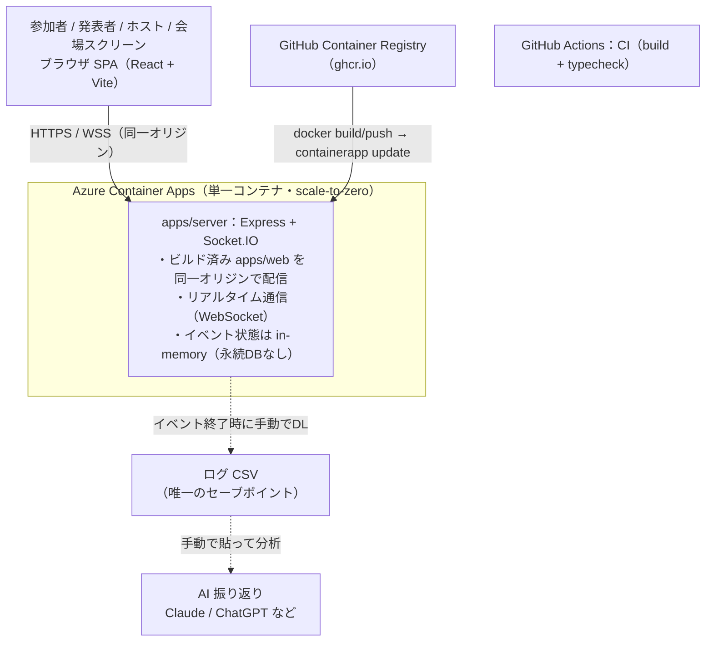

# SparkPlug ⚡


**発表者と参加者の間に流れる情報を可視化・拡張・保存する** — コミュニティイベント向けのリアルタイム盛り上げ + 振り返りアプリ。

> Spark plug = 点火プラグ。エンジンをかける。場に火をつける。

> 📖 **イベントを運営する主催者の方へ**: 作成 → 会場の仕込み → 本番 → 振り返りの操作手順は [主催者マニュアル](docs/主催者マニュアル.md) にまとめています。

## 3つの機能軸

| 軸 | 機能 |
|---|---|
| 🔥 盛り上げ | コメント流し・リアクション爆発・SE/音・演出 |
| 🎤 拾い上げ | アンケート・投票・自由記述・クイズ |
| 📊 振り返り | ログ分析・AIまとめ・タイムライン・繋がり可視化 |

## アーキテクチャ



> 当初は web=Static Web Apps / server=Container Apps の分離構成 + Cosmos DB を想定していたが、公開URL最速化のため **Express が web のビルド済み静的ファイルを同一オリジンで配信する単一コンテナ構成**に変更（CORS 不要）。永続化（Cosmos DB）も**見送り**（in-memory 運用＋終了時 CSV 回収）。AI 振り返りは**専用実装せず手動運用**（CSV を Claude/ChatGPT 等に投げる）。

コスト方針: 単一コンテナを Azure Container Apps に scale-to-zero で配置。無アクセス時のコンテナ実行は ¥0。イメージは GitHub Container Registry（ghcr.io、private + 限定スコープ PAT で pull）を使い、Azure Container Registry の固定費（Basic 約 $5/月）は発生しない。イベント当日は min replica 1 に上げて数十〜数百円/日。

## リポジトリ構成

```
apps/
  web/       React + Vite SPA（host / presenter / audience / screen / overlay の5ビュー）
  server/    Express + Socket.IO リアルタイムサーバー
packages/
  shared/    クライアント/サーバー共有の Socket.IO イベント型定義
```

## 開発

```bash
npm install
npm run build          # shared → server → web の順にビルド
```

`dev:server` と `dev:web` は**2つのターミナルで同時に**起動しておく（片方だけだと画面は開けてもリアルタイム通信が繋がらない）。

```bash
npm run dev:server     # http://localhost:3001 (ヘルスチェック: /health)
npm run dev:web        # http://localhost:5173
```

※ 初回は `npm run build` で `packages/shared` をビルドしてから dev を起動すること。

### 動作確認（5つのビュー）

イベントID（`demo`など好きな文字列）ごとに以下のURLを開く:

| ビュー | URL |
|---|---|
| ホスト | `/e/{eventId}/host?t=<token>` （要権限トークン） |
| 発表者 | `/e/{eventId}/presenter?t=<token>` （要権限トークン） |
| 参加者 | `/e/{eventId}` |
| 会場スクリーン | `/e/{eventId}/screen` |
| OBSオーバーレイ | `/e/{eventId}/overlay` |

会場スクリーンの画面共有機能（Screen Capture API）はセキュアコンテキスト（`localhost` / `https`）でのみ動くため、**必ず `localhost` 経由で開く**こと。

オーバーレイビューは OBS 等の配信ソフト連携用（Browser Source に `/e/{eventId}/overlay` を追加すると、会場スクリーンのQR・操作ボタン・背景共有映像を除いた、透明背景で演出だけが重なる）。Teamsハイブリッドの基本構成では OBS は不要（会場スクリーンの背景キャプチャで足りる）。使い分けは [主催者マニュアル](docs/主催者マニュアル.md) の 4-1 を参照。レイヤーはURLクエリで絞れる（例: `/e/{eventId}/overlay?comments=0&questions=0&poll=0&se=0` はリアクションのみ）。

### ホスト/発表者リンク（権限トークン）

ホスト・発表者ビューは乗っ取り防止のため**権限トークン付きURL**が必要（参加者・会場スクリーンは不要）。トークンは `eventId` ごとにサーバー秘密鍵から導出される。

```bash
npm run host-link -- <eventId>                      # host/presenter のURLを出力（既定 baseUrl は http://localhost:5173）
npm run host-link -- <eventId> https://<本番URL>     # 本番用リンクを発行
```

- サーバー秘密鍵は `HOST_SECRET` 環境変数で設定する。**本番デプロイ時は必ず設定すること**（未設定だと開発用の既定値が使われトークンが推測可能。サーバー起動時に警告が出る）。
- `host-link` を実行する側もサーバーと同じ `HOST_SECRET` を使う（例: `HOST_SECRET=xxxx npm run host-link -- plug2026`）。
- 開発時のみ `GET /events/{eventId}/host-link` でもトークンを取得できる（`HOST_SECRET` 設定済みの本番では 403）。ローカルのトップページ `/` の「主催者ホスト画面 / 発表者ビュー」リンクはこれを使って自動でトークン付きになる。
- トークンが無い / 誤っているとアクセス拒否画面が表示される。

### スマホなど別端末からアクセスする（同一LAN）

`dev:web`（`vite --host`）は既にLAN内へバインドされるので、PCのLAN IPで `apps/web/.env.local`（gitignore対象・各自作成）に以下を設定するだけでよい:

```
VITE_SERVER_URL=http://<PCのLAN IP>:3001
VITE_AUDIENCE_URL=http://<PCのLAN IP>:5173
```

`VITE_AUDIENCE_URL` は会場スクリーンのQRコードに埋め込む参加者URLの基点。スクリーンを画面共有のため `localhost` 経由で開いた場合でも、QRにはスマホから読めるLAN IPが埋め込まれるようにするための設定。

### デモ用の活動を流し込む（スクリーンショット・録画用）

実際に参加者を集めなくても、会場スクリーンにリアクション連打・コメント流し・AA・アンケート（開始→投票→締切）をまとめて流せるスクリプトがある。参加者UIは経由せず `socket.io-client` で直接サーバーに接続する:

```bash
npm run demo:seed -- <eventId>   # 例: npm run demo:seed -- demo
```

`dev:server` を起動した状態で、会場スクリーン（`/e/{eventId}/screen`）を開いておいてから実行する。`SERVER_URL` 環境変数でサーバーURLを上書き可能（既定 `http://localhost:3001`）。中身は `scripts/demo-seed.mjs`。

## Roadmap

- [x] モノレポ雛形（web / server / shared）
- [x] リアクション送受信のリアルタイムデモ（ルーム = イベント単位）
- [x] コメント流し（参加者 → 会場スクリーン、匿名/記名）
- [x] コメントの流れ方（横流れ ⇄ 下から上）をホストから切り替え（通常コメントのみ、既定は横流れ）
- [x] AAコメント対応（某動画配信サイトリスペクトの複数行アスキーアート、等幅・改行保持でゆっくり流す）
- [x] SE 再生（ドン/カッ/拍手。フリー素材 mp3 + Web Audio API 合成フォールバック）
- [x] 選択式アンケート + リアルタイム集計（ホスト作成/締切、投票し直し可、スクリーンにライブ表示）
- [x] Dockerfile + Azure Container Apps に単一コンテナでデプロイ（検証環境 = VS Enterpriseサブスク）
- [x] 本番デプロイ（PAYGサブスク、ghcr.io起点、2026-08-18）
- [ ] ~~Azure Static Web Apps 分離デプロイ + GitHub Actions CD~~ → **見送り**（Express が web を同一オリジン配信する単一コンテナ構成を採用。現状デプロイは `docker build/push`（ghcr.io） → `containerapp update` の手動）
- [x] ログ CSV エクスポート（UTF-8 BOM、Excel対応。※in-memory運用のため**イベント終了時にDLすること**。再起動/スケールダウンで消える）
- [ ] ~~イベントログ永続化（Cosmos DB）~~ → **見送り**（in-memory運用を継続。落ちても自動再起動＋クライアント自動再接続で復帰、失うのは溜めたログのみ。データはイベント終了時にCSVで都度回収する方針）
- [x] 発表者ビュー: エモメーター（波形＋熱量＋バイブ）・質問（参加者が表示名付きで発表者に送る）
- [x] 質問トリアージ（いいね・今答える/後で/後日の振り分け、後ではいいね順、スクリーンにピン留め）
- [x] 会場スクリーンのQRコード表示・効果音ON/OFFをホストから制御（共に既定ON）
- [x] ホスト/発表者の権限トークン（URL手打ちでの乗っ取り防止、`?t=` 方式・`HOST_SECRET` 本番必須）
- [x] 画面共有（発表スライド等を会場スクリーンの背景に取り込み、演出はその上に重ねる）
- [x] AI 振り返り分析 → **手動運用**（エクスポートしたCSVを Claude / ChatGPT 等に投げて分析。専用実装は見送り）

## ブランドアセット

| ファイル | 用途 |
|---|---|
| `assets/logo.svg` | メインロゴ（点火するプラグ） |
| `assets/icon.svg` + `icon-192/512.png` | PWA・ファビコン用アイコン |
| `assets/wordmark.svg` | サイトヘッダー・ドキュメント用ワードマーク |
| `assets/plug-community-logo.png` | PLUG コミュニティ本体のロゴ |

SparkPlug は [PLUG（Power Platform Local User Group）](https://github.com/PLUG365) 発のプロジェクトです。

## クレジット

効果音素材: [OtoLogic](https://otologic.jp/)（CC BY 4.0）
`apps/web/public/se/` の mp3 は OtoLogic 素材（Tambourine / Hyoshigi01 / Applause02）をリネームして使用。

## License

MIT（効果音 mp3 を除く。上記クレジット参照）
